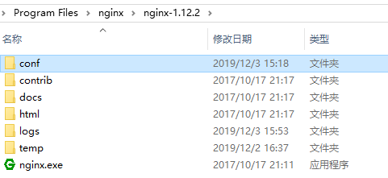
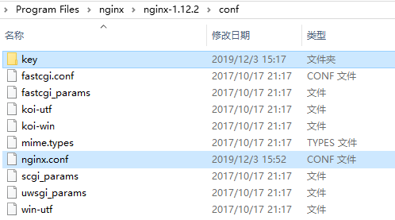
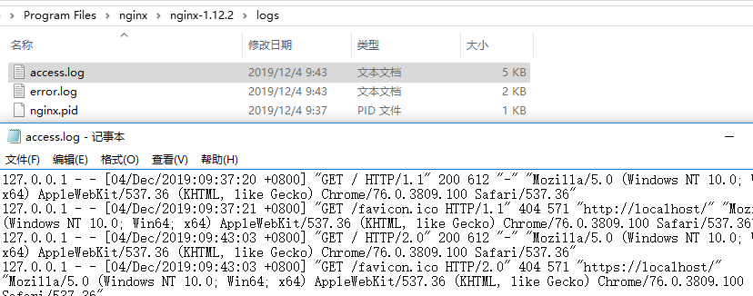

## 说明
本次 HTTP2.0 基于 nginx 进行测试，系统环境为windows，Linux系统可自行百度解决
## 1. 安装OpenSSL、生成伪证书
### 1.1 安装包下载
windows版本下载地址： [http://slproweb.com/products/Win32OpenSSL.html](http://slproweb.com/products/Win32OpenSSL.html)，版本限制  `1.0.2 +`，将文件包解压缩到可以通常软件安装位置
### 1.2 生成证书
在 OpenSSL 安装包内 `shift + 右键` 打开命令行
~~~
// 生成一个RSA私钥
# openssl genrsa -des3 -out server.ori.key 2048
.... // 自行加密，密码会用于下面
// 生成免密码输入key
# openssl rsa -in server.ori.key -out server.key
// 创建证书签名请求CSR文件
# openssl req -new -key server.key -out server.csr
... // 填写一些信息，可随意填写，但请记住填写的内容
// 制作CA证书
# openssl x509 -req -days 365 -in server.csr -signkey server.key -out server.crt

// 所有操作完成后会生成四个文件： server.crt、server.csr、server.key、server.ori.key
~~~
## 2. 安装、配置 nginx
### 2.1 安装包下载
[http://nginx.org/en/download.html](http://nginx.org/en/download.html)（请下载 `nginx-1.9.5 +` ，1.9.5 以下不支持 `http2` ），将文件包解压缩到可以通常软件安装位置，打开安装包解压后文件夹，双击 `nginx.exe` 文件即可运行 nginx ，浏览器中输入地址 `localhost` ，即可测试安装是否成功
### 2.2 配置 nginx 支持 HTTP2.0
* 打开配置文件夹 `conf` （不同版本可能名称不同，但认准为配置文件夹即可）

* 将第一步中生成的证书、秘钥等四个文件拷贝到配置文件夹 `conf` 内的 `key` 文件夹

* 编辑 `nginx.conf` ： 找到 被注释掉的 `http2` 板块，并将其放开，添加 http2 支持，将证书文件名称替换为放置在配置文件夹内的文件名称
    ~~~
    # HTTPS server
    #
    server {
        listen       443 ssl http2;
        server_name  localhost;

    # key and crt
        ssl_certificate      key/server.crt;
        ssl_certificate_key  key/server.key;

        ssl_session_cache    shared:SSL:1m;
        ssl_session_timeout  5m;

        ssl_ciphers  HIGH:!aNULL:!MD5;
        ssl_prefer_server_ciphers  on;

        location / {
            root   html;
            index  index.html index.htm;
        }
    }
    ~~~
### 2.3 配置完成，测试
关于 nginx 运行、停止的一些指令：
```
  start nginx // 启动
  nginx -s quit // 退出运行
  nginx -s stop // 停止运行
  nginx -s reload // 重新启动
  以上指令需要在安装包文件夹内运行才可，若想简单关闭 nginx ，可直接打开任务管理器，找到 nginx 运行任务并结束任务即可
```


关闭之前测试时打开的 `nginx` ，重新启动，在浏览器中，输入 `https://localhost` 在输出日志文件夹 `logs` 中  `access.log` 或 `error.log` 即可查看本次 `http` 请求信息。

