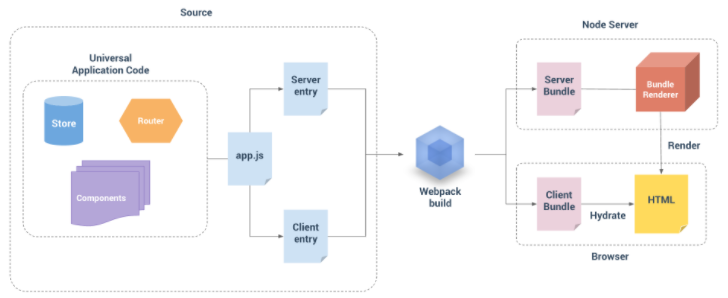

# VUE SSR

vue 服务端渲染解决方案

## 什么是服务端渲染

在服务端完成数据与视图的组合，生成完整的html页面，返回给客户端，客户端直接进行渲染。

## 为什么不是预渲染

预渲染：在构建时生成匹配预渲染路径的html文件

**优点**

*   支持soe
    
*   客户端首屏加载优化
    
*   项目转换快：在构建时引用包即可完成
    

**缺点**

*   不适合个性化内容：同一个页面，不同用户看到的内容有所差别
    
*   不适合多数据请求页面：页面加载需要等待请求加载完成，反而变得很慢
    
*   不适合多路由，会导致构建时间增长
    
*   需要路由配置 `model: "history"`
    

demo 传送门：[https://github.com/pimingzhao/VUE\_SSR/tree/master/pre-render](https://github.com/pimingzhao/VUE_SSR/tree/master/pre-render)

## 1. vue-ssr

中文官方文档：[https://ssr.vuejs.org/zh/https://ssr.vuejs.org/zh/](https://ssr.vuejs.org/zh/https://ssr.vuejs.org/zh/)

### 1. vue-ssr 构建流程

demo 传送门： [https://github.com/pimingzhao/VUE\_SSR/tree/master/04](https://github.com/pimingzhao/VUE_SSR/tree/master/04)

#### 常见问题：

##### 使用 mini-css-extract-plugin 分离 css 错误

`extract-text-webpack-plugin` 只支持 `webpack 4` 以下进行 `css`分离。在 `webpack 4+` 版本，推荐使用 `mini-css-extract-plugin` 进行 `css` 分离；但是 `mini-css-extract-plugin` 的 api 中 `insert` 项会通过 `document` 将分离出来的css文件注入到head中。在服务端 `node` 中没有 `document` 对象，这就会导致错误。所以目前不可以单独分离 `css` 文件。

### 2. vue-ssr 部署

将模板文件 `index.template.html` 、打包后的文件夹 `dist` 、`package.json` 文件、`server.js` 文件，复制到服务器端，然后命令行执行 `yarn install --production` （只下载生成环境下所需的依赖），下载好依赖后，再执行 `yarn serve` 命令启动服务器。

### 3. 服务端渲染原理

> 将渲染分为了两部分处理，服务器会返回一部分html模板数据，客户端验证并组合相应的内容，最终生成完整的html页面返回浏览器。
> 
> 在浏览器请求时，服务端返回html模板数据，客户端vue 通过验证并组合模板数据，在有新的动态数据时，由客户端js脚本处理并响应。

### 4. 其他

#### 4.1 通用性代码的理解

*   通用性代码指即可在服务端运行也可在客户端运行的代码
    
*   在服务端（nodejs）是没有 [BOM](https://www.runoob.com/js/js-window.html) 和 [DOM](https://www.runoob.com/js/js-htmldom.html) 的，所以在通用代码中不应该出现有关 `BOM` 或 `DOM` 的 `api` 使用
    

#### 4.2 控制组件的运行环境（只在服务端或只在客户端）

demo 传送门：[https://github.com/pimingzhao/VUE\_SSR/tree/master/router-ssr](https://github.com/pimingzhao/VUE_SSR/tree/master/router-ssr)

*   通过 `router` 控制：
    
    *   服务端渲染过程中也需要路由部分，在路由中添加元信息，通过元信息，只返回需要在服务端渲染的路由部分。这样在 webpack bundle serve 时只会处理需要的路由组件。
    
*   通过 [$isServer](https://cn.vuejs.org/v2/api/#vm-isServer) 控制：
    
    *   api 的解释是当前实例是否运行于服务器，也就是说如果是服务端渲染的话就是 `true`
        
    *   对于任意组件，我们可以通过设置 `v-if="$isServer"` 让其只在服务端渲染，相反的，设置 `v-if="!$isServer"` 让其只在客户端渲染。
        

## 2. Nuxt.js

> 直接选用先有的框架似乎是个不错的选择，但是对于已经做完的项目，代码的改动量将会很大。

中文官方文档：[https://www.nuxtjs.cn/guide](https://www.nuxtjs.cn/guide)