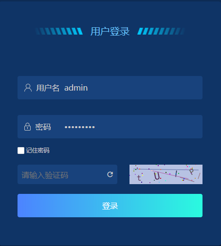

# canvas

## 1.简介

HTML5 的新特性：在添加完成 `canvas` 元素后，通过 `js` 脚本绘制图案。

## 2.验证码案例

案例说明：在用户登录时提供验证码功能（登录错误超过几次之后显示，设置验证码的实效时间）

案例环境：vue

参考文档：[登录随机验证码的实现](https://www.cnblogs.com/moning/p/7868731.html)、[如何给localStorage设置一个过期时间？](https://blog.csdn.net/weixin_43254766/article/details/83618630)

### 2.1实现思路：

使用canvas绘制验证码

localstorage中存储密码错误次数及第一次密码错误时间

账号或密码验证错误时从缓存中读取错误次数

### 2.2具体代码

验证码页面元素canvas属性方法设置

~~~
<li class="verification" v-if="showVerify">
          <input @blur="handleVerify" type="text" v-model.trim="verification" placeholder="请输入验证码" />
          <Icon title="刷新验证码" @click="drawVerification" class="icon-refresh" type="md-refresh" />
          <canvas title="点击刷新" @click.prevent="drawVerification" id="canvas" width="150px" height="40px"></canvas>
        </li>
~~~

绘制验证码方法

~~~
// 绘制验证码方法
drawVerification() {
  const canvas = document.getElementById("canvas");
  const str =
        "0123456789ABCDEFGHIJKLMNOPQRSTUVWXYZabcdefghijklmnopqrstuvwxyz";
  let verifyVal = ""; // 初始定义随机数
  const num = 4; // 设置随机数个数
  const width = canvas.clientWidth;
  const height = canvas.clientHeight;
  const ctx = canvas.getContext("2d");
  // 设置、填充画布底板
  ctx.fillStyle = randomColor(180, 240);
  ctx.fillRect(0, 0, width, height);
  // 绘制随机验证码
  for (let i = 0; i < num; i++) {
    const x = (width / num) * i + 15;
    const y = randomNum(height / 1.8, height / 1.2);
    const deg = randomNum(-45, 45);
    const txt = str[randomNum(0, str.length)];
    verifyVal += txt; // 获取一个随机数
    ctx.fillStyle = randomColor(10, 100); // 字体填充随机颜色
    ctx.font = randomNum(18, 25) + "px SimHei"; // 设置字体
    ctx.translate(x, y); // 将当前xy坐标作为原始坐标
    ctx.rotate((deg * Math.PI) / 180); // 旋转随机角度
    ctx.fillText(txt, 0, 0); // 绘制文本时以当前坐标为起点
    ctx.rotate((-deg * Math.PI) / 180); // 重置文本旋转角度
    ctx.translate(-x, -y); // 将坐标系统重置为原始坐标
  }
  // 绘制不规则线条
  for (let i = 0; i < num; i++) {
    // 定义画笔颜色
    ctx.strokeStyle = randomColor(90, 180);
    ctx.beginPath();
    // 定义线条路径
    ctx.moveTo(randomNum(0, width), randomNum(0, height));
    ctx.lineTo(randomNum(0, width), randomNum(0, height));
    // 按路径绘制
    ctx.stroke();
  }
  // 绘制圆点
  for (let i = 0; i < num * 10; i++) {
    ctx.fillStyle = randomColor(0, 255);
    ctx.beginPath();
    ctx.arc(randomNum(0, width), randomNum(0, height), 1, 0, 2 * Math.PI);
    ctx.fill();
  }
  this.verifyVal = verifyVal;
}
~~~

登录验证

~~~
async login() {
  // ...
  try {
    const res = await loginCheck(userInfo);
    // ...
    localStorageUtils.remove("failureTimes");
    localStorageUtils.remove("failureTimes__expired__");
  } catch (err) {
    const failureTimes = (localStorageUtils.get("failureTimes") || 0) + 1;
    // 登录验证错误超过4次时，显示并绘制
    if (failureTimes > 4) {
      this.showVerify = true;
      if (this.verification) {
        this.verification = "";
      }
      await this.$nextTick();
      this.drawVerification();
    }
    if (failureTimes === 1) {
      const userInfo = localStorageUtils.get("userInfo");
      if (userInfo && userInfo.password) {
        // 若选择了记住密码，首次登录验证不通过时将密码清空
        localStorageUtils.save("userInfo", {
          loginName: userInfo.loginName
        });
      }
    }
    // 缓存密码错误次数与当前错误时间
    localStorageUtils.save("failureTimes", failureTimes, true);
  }
}
~~~

缓存控制

~~~
export default {
  save(key, value, expired = false) {
    this.remove(key);
    if (expired) {
      localStorage.setItem(
        `${key}__expired__`,
        Date.now() + 1000 * 60 * 60 * 3
      );
    }
    localStorage.setItem(key, JSON.stringify(value));
  },
  get(key) {
    const expired = localStorage.getItem(`${key}__expired__`);
    if (expired && Date.now() >= expired) {
      // 超出时间期限
      this.remove(key);
      this.remove(`${key}__expired__`);
      return;
    }
    const value = localStorage.getItem(key);
    if (value) {
      try {
        return value ? JSON.parse(value) : null;
      } catch (error) {
        // JSON.parse("xxx") 非对象字符串出错，直接返回对应的字符串
        return value ? value : null;
      }
    } else {
      return;
    }
  },
  remove(key) {
    localStorage.removeItem(key);
  },
  removeAll() {
    localStorage.clear();
  }
};
~~~